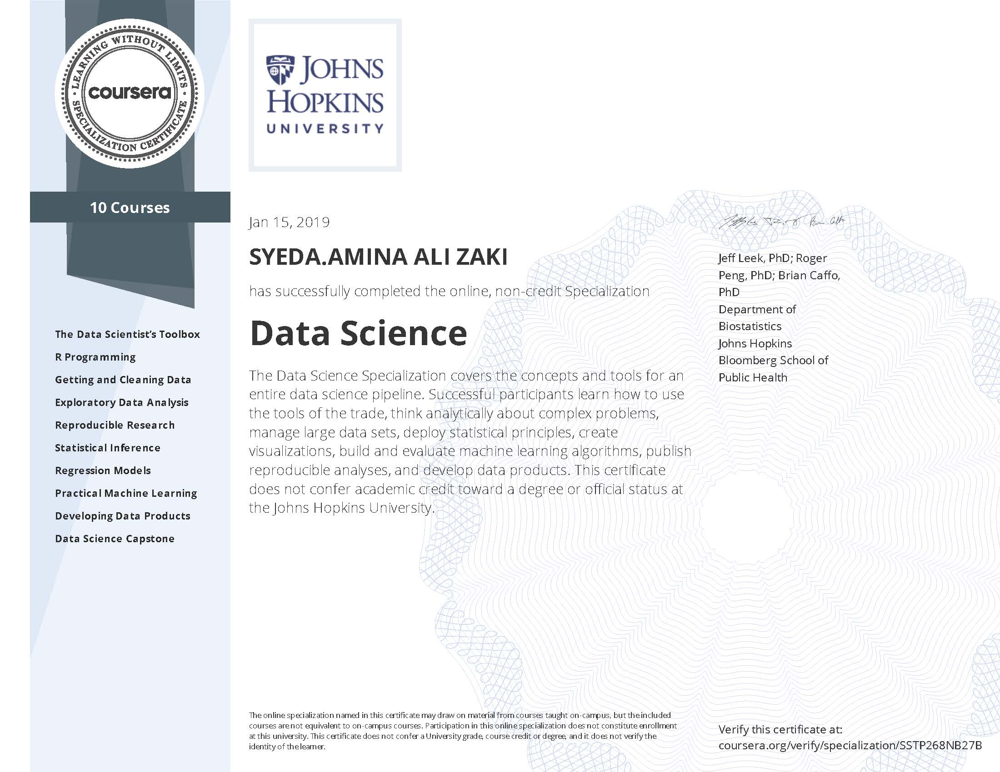

# Data-Science-Specialization

#Specialization Certificate

# Data Science Specialization by Johns Hopkins University on Coursera.
Ask the right questions, manipulate data sets, and create visualizations to communicate results. This Specialization covers the concepts and tools needed throughout the entire data science pipeline, from asking the right kinds of questions to making inferences and publishing results. Final Capstone Project - apply the skills learned by building a data product using real-world data. Resulting in a portfolio demonstrating mastery of the material. 

# List of Courses
## Course 1: The Data Scientist’s Toolbox
## Course 2: R Programming
## Course 3: Getting and Cleaning Data
## Course 4: Exploratory Data Analysis
## Course 5: Reproducible Research
## Course 6: Statistical Inference
## Course 7: Regression Models
## Course 8: Practical Machine Learning
## Course 9 : Developing Data Products
## Course 10 : Data Science Capstone

